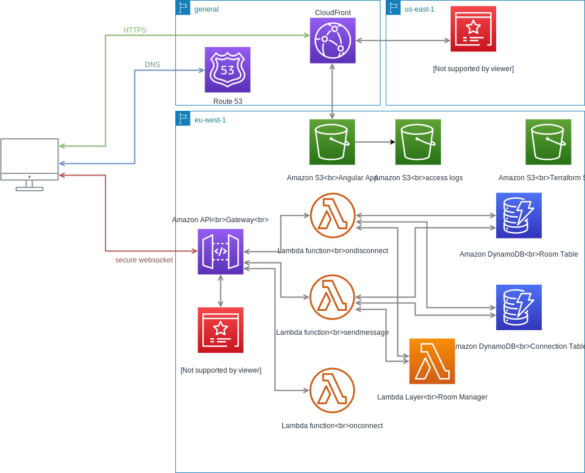

# **Synchronous Chess**

This project is an online chess board game. It implements the chess variant called `Synchronous chess`. For more detail about the rules, see [this website](http://www.hexenspiel.de/engl/synchronous-chess/) 

## **In progress - demo**

The app is currently in development. It is possible to try it out the testing version at https://sc-staging.steins.fr

**Important: The website is only in French for the moment!**

In the demo, you can choose either to create a room or join an existing one. 

The room creator is the host, if he leave the room, the participants can continue to interact but no-one can join anymore.

### Synchronous Chess demo

The host is the white player and the first joining participant is the black player. The others are just spectators. 

Drag & Drop a piece to validate a move. The registered move will be displayed with two green cells: the origin and the destination. When both players has played, both moves will be played.

For the Synchronous Chess rules, please refer to [this website](http://www.hexenspiel.de/engl/synchronous-chess/).

### Chat demo

A simple chat demo with ping displayed between peers. For the moment, you have to click on the send button for sending the message. The `Enter` key is not supported.
The displayed errors are generics, this need some more works.

## **Application**

### **Backend**
---

The backend is designed to run on AWS lambda (lambda functions/layers).

**Language**: Typescript.

#### Room Manager Layer

Layer that helps lambdas for managing the rooms. It exposes two services:

**Room service**: Manage the room (create/update/remove).

**Connection service**: Manage the websocket connections and links connections to a room. That permits to identify the room for connection id. Used for removing a player from the room queue or detect room host disconnection.

#### Websocket API Lambdas

**Required**: Room Manager Layer.

The API is composed of 3 lambdas for managing websocket connection, disconnection and messages. The two last lambdas uses the *room manager layer* and the two *dynamoDB tables*.

**onconnect** - Handle and log new websocket opened connection.

**ondisconnect** - Handle websocket disconnection. It will remove a player from a room queue or remove a room if the host was disconnected.

**sendmessage** - Handle all the websocket exchanges separated in host and peer roles. Available messages:
 - **create** - Create a new room if the room name is available;
 - **add player** - only host - Add a new player to the room player list;
 - **remove player** - only host - Remove a player from the room player list;
 - **get players** - only host - Get the room player list
 - **signal to peer** - only host - Send the RTC signal to a specific peer waiting in the room queue;
 - **join** - Ask to join a room and add the player in the room queue;
 - **signal to host** - only peer - Send the RTC signal to the room host. The peer have to be in the waiting queue.


### **Frontend**
---

The synchronous chess board game with chat. 

**Required**: Backend Websocket API.

**Technology**: Angular 9.

**Language**: Typescript.

### **Databases**
---

#### Room Table

- ID: Id of the room also the room name;
- connectionId: Websocket connection id of the host;
- hostPlayer: Player name of the host;
- maxPlayer: Maximum of player that can join the room;
- players: List of players currently in the room;
- queue: List of joining players.

#### Connection Table

The connection table is used as a relation table. Given a connectionId, we can found the room ID in which the player is participating.

- connectionId: Websocket connection id of a peer or host;
- roomName: Room ID.

## **Infrastructure**

The project is hosted on Amazon Web Services and uses Terraform to provision and manage the cloud infrastructure.



#### Services:
 - S3: Stores the frontend files and their access logs;
 - CloudFront: Serves the frontend from S3 and manage the cache;
 - Lambda: Run the Room API designed for Websocket;
 - API Gateway: Manages Websocket connection and API calls, then transmits calls to the lambdas;
 - DynamoDB: Stores the Rooms informations for the API;
 - Route 53: Manage the DNS records;
 - CloudWatch: Monitors and logs;
 - ACM: Manage the certificates.

 A data-source is used for the certificate from AWS Certificate Manager. I prefer creating manually the certificate, its more easier. 

 The API Gateway is not provisioned by Terraform because the AWS provider do not permits Websocket API creation. 

#### Terraform init backend configuration

Important: Terraform states are stored in a S3 bucket.

The Terraform backend configuration variables:
- bucket: S3 bucket where is stored the terraform states;
- key: Bucket path of the terraform states;
- region: AWS region.

#### Terraform plan vars

- stage: Stage name. Ex: 'dev';
- acm_certificate_arn: AWS arn of the certificate that CloudFront have to serve.
- main_domain_name: Domain name principal. As example, 'steins.fr'

The app will be deployed by adding automatically sub-domains.
- frontend: sc-{stage}.{main_domain_name};
- backend: Currently managed manually.

## **CI/CD**

This project started with the new CI/CD GitHub solution named GitHub Actions then migrated to CircleCI. GitHub Actions is good but miss a lot of features like:
- Manual trigger;
- Docker image caching when pulling images;
- Save dependencies in cache to avoid installing them in each jobs;
- Control on the volume work directory mount path when using Docker images.

### CircleCI jobs

```
Frontend Lint --\                 HOLD - manual trigger
                 \                          \
Frontend Test ----|--|- TF init -- TF plan --|-- TF apply
                 /  /
Frontend Build -/  /
                  /
Backend Build----/
```
To improve:
- Add Backend Test
- Add Frontend sonarscan
- Add Backend lint & sonarscan

### Github Actions jobs

It was impossible to achieve a working sonarscan on CircleCI. 
It detected CircleCI auto-configuration but throw error that the pull request ID was not provided. Same if it was given as option.

```
Frontend Test ----- SonarQube scan
```

## QA - SonarCloud

[Frontend Dashboard](https://sonarcloud.io/dashboard?id=Steins-fr_synchronous-chess)