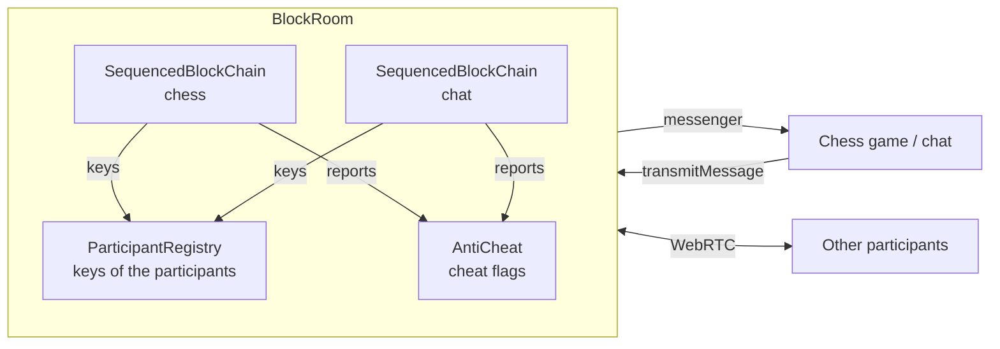
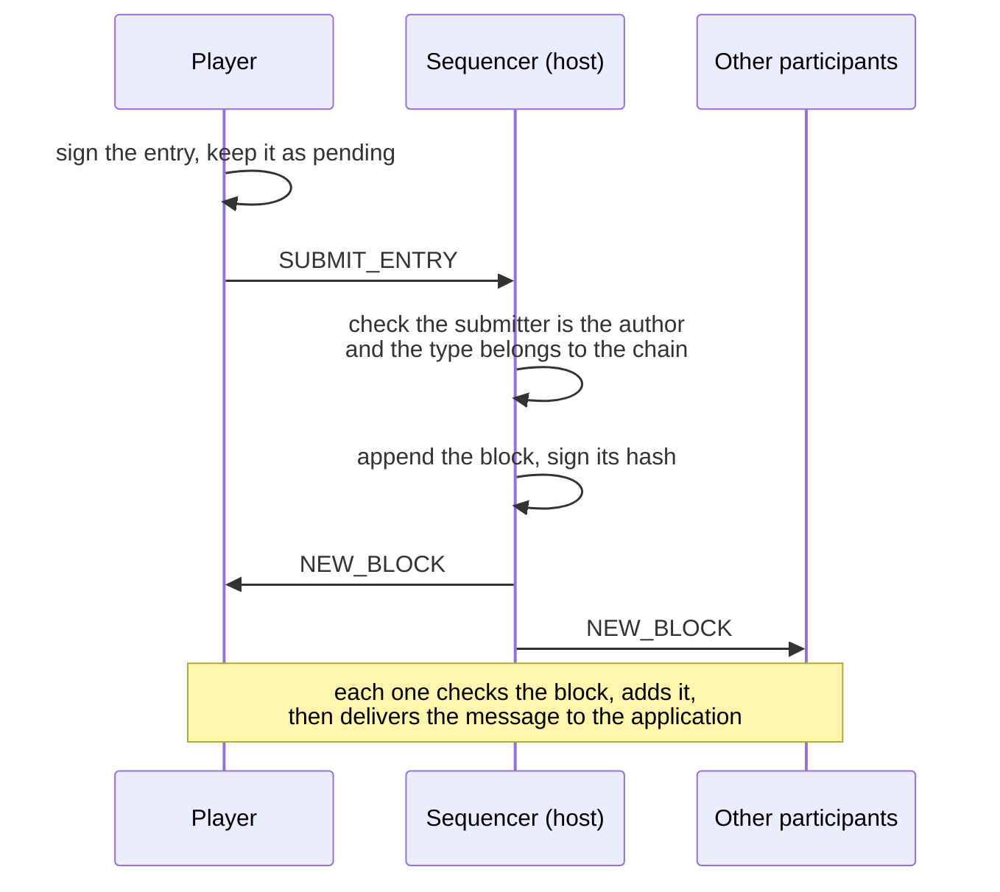
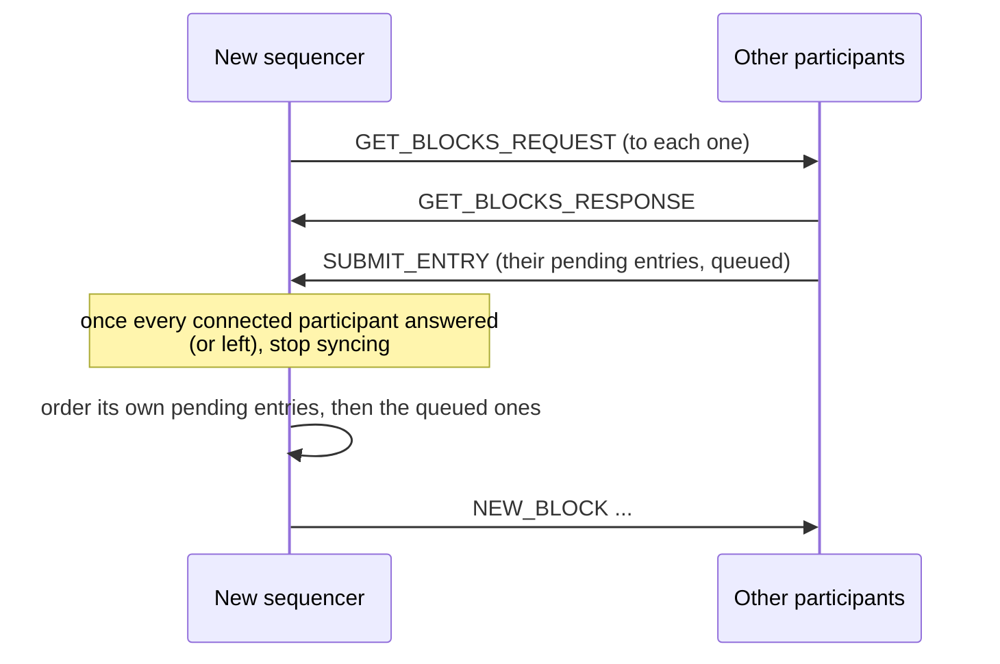

# Block chains and anti-cheat

The players of a room talk directly to each other over WebRTC, without a game server. Every chess move
and chat message goes through a **block chain**, so that all the participants receive the same
messages in the same order and can check who wrote them. An **anti-cheat** system runs beside the
chains: each participant checks the blocks it receives and reports the cheats to the others.

The code lives in `application/frontend/game-app/src/app/services/room-manager/classes/room/block-room`.

- [Overview](#overview)
- [Identity of the participants](#identity-of-the-participants)
- [Blocks and signatures](#blocks-and-signatures)
- [Ordering the blocks](#ordering-the-blocks)
- [Catching up](#catching-up)
- [When the host leaves](#when-the-host-leaves)
- [Anti-cheat](#anti-cheat)
- [Messages](#messages)
- [Trust model and limits](#trust-model-and-limits)
- [Adding a message type or a chain](#adding-a-message-type-or-a-chain)

## Overview

A room (`BlockRoom`) runs **one block chain per feature**: `chat` and `chess`. Each chain orders its
blocks on its own, so a busy chat never delays the moves of the game. The chains share the WebRTC
connections and the identity of the participants.

Each chain is ordered by a single participant, the **sequencer**: the host of the room, then the
participant taking over when it leaves. The participants sign their messages and submit them to the
sequencer, which appends them to the chain and broadcasts the blocks. A single participant orders the
chain, so it can not fork.



| Class | File | Role |
|---|---|---|
| `BlockRoom` | `block-room.ts` | Routes each message type to its chain, dispatches the received messages, names the sequencer |
| `SequencedBlockChain` | `block-chain/sequenced-block-chain.ts` | Submits, orders, receives and checks the blocks of one chain |
| `Chain` | `block-chain/chain.ts` | The list of blocks, hashing and signing |
| `ParticipantRegistry` | `block-chain/participant-registry.ts` | Exchanges the public keys, shared by all the chains |
| `ParticipantKeyStore` | `block-chain/participant-key-store.ts` | Keeps the key pair of the player in the browser |
| `AntiCheat` | `anti-cheat/anti-cheat.ts` | Collects the cheat reports into flags |

The application only sees `Room.transmitMessage()` and `Room.messenger()`: a message is delivered to
every participant, its sender included, once its block is added to the chain.

## Identity of the participants

Each player has an **ECDSA P-384 key pair**, which signs its messages.

- **Kept across reloads.** `ParticipantKeyStore` stores the key pair of each player name in IndexedDB
  (database `synchronous-chess`, store `participant-keys`). A player reloading the page keeps its
  identity, so the blocks it signed before stay verifiable. The private key is not extractable: it
  can only sign. Without storage (private browsing, blocked site data), the page uses a key pair of
  its own, which a reload replaces.
- **Exchanged once per room.** `ParticipantRegistry` sends the public key to each new player, for all
  the chains at once. The request carries the key of the requester too, so if a request is lost (sent
  before the other side knew the player), the request of the other side still exchanges both keys.
  The key of a connection is registered once, from its request or its response.
- **Keyring.** A participant keeps the keys of the previous connections of its player: a player who
  lost its stored key signs with a new one, and its older blocks stay verifiable.
- **Departed participants** are kept 60 seconds, the time for the blocks they wrote to reach everyone,
  then forgotten. A participant who leaves before any of its keys is known is forgotten at once.

## Blocks and signatures

```ts
interface ChainEntry {      // a message of a participant
    id: string;            // random UUID, to detect a replayed entry
    data: AppMessage;      // { from, type, payload }
    signature: string;     // by the author
}

class Block {
    index: number;
    previousHash: string;
    entry: ChainEntry;
    sequencer: string;          // the participant who ordered the block
    hash: string;
    sequencerSignature: string; // by the sequencer, over the hash
}
```

| What | Signed or hashed content | By |
|---|---|---|
| Entry signature | `chain id JSON(data)` | the author (`data.from`) |
| Block hash (SHA-256) | `chain index previousHash sequencer entry.id entry.signature JSON(entry.data)` | |
| Sequencer signature | the block hash | the sequencer |

The **chain name** is part of both the entry signature and the block hash: an entry or a block of one
chain is not valid on another chain of the room.

The genesis block (index 0) is the same for every chain, with a fixed hash.

## Ordering the blocks



- The sequencer accepts an entry only from its own author: the WebRTC connection proves who sent it.
  An entry already in the chain (submitted again) is not ordered twice.
- When the sequencer transmits a message, it orders the entry directly.
- A participant adds a `NEW_BLOCK` only from its current sequencer. Each chain handles its messages one
  at a time, so the blocks are added strictly in order.
- The entries of the local participant stay **pending** until their block is added: they are submitted
  again when the sequencer becomes ready (its key is received) or when it changes.

## Catching up

A participant missing blocks asks for them with `GET_BLOCKS_REQUEST { from }`, the index of its next
block. The response carries at most **50 blocks**, to fit in a data channel message; a full page is
followed by a request for the next one.

A participant catches up:

- with the sequencer, once the key of the sequencer is received (joining the room);
- with the sequencer, when a `NEW_BLOCK` leaves a gap after its latest block;
- with the new sequencer, when it changes.

A participant only processes the responses it asked for. A refused block stops the catch up with that
participant, since asking again would bring the same block.

## When the host leaves

The remaining participant whose name comes first becomes the sequencer. Every participant knows the
same participants, so they all name the same one.



The former sequencer may have sent its last blocks to some participants only. The new sequencer first
collects the blocks of all the participants, so these blocks are kept and **no block is rolled back**.
The entries the former sequencer did not order are submitted again by their authors; an entry already
in the chain is not ordered twice.

New players can not join once the host has left: joining goes through the host.

## Anti-cheat

The sequencer orders the chain alone, so the other participants watch it. Each participant checks the
blocks it adds and reports the cheats to everyone, outside the chains: a report does not need to be
ordered, and the sequencer can not hide it.

### Checks

| Reason | Detected when | Block delivered to the application |
|---|---|---|
| `forgedAuthor` | The entry is not signed by any known key of its author | yes, flagged |
| `replayedEntry` | The entry id is already in the chain | no |
| `wrongChain` | The message type belongs to another chain | no |
| `forgedSequencing` | The block is not signed by its sequencer | yes, flagged |
| `invalidBlock` | The hash of a block of the sequencer does not match its content | no, not added |
| `conflictingBlock` | The sequencer sent another block for an index already in the chain, or a block not following the latest one | no, not added |

- `replayedEntry` and `wrongChain` only depend on the chain, so every participant finds them alike:
  they all leave the block out of the application, and stay consistent.
- The signatures depend on the keys each participant knows, so a block with a forged signature is
  still delivered, with a flag. The author of an entry who left before the participant joined is
  unknown: its entry can not be checked.
- The author signature of a participant whose key is still being exchanged is checked once the key is
  received (at most 32 blocks waiting per author).

### Reports and flags

A participant reports a cheat it detects with an `anti_cheat` message to all the others, once per
block and reason. `AntiCheat` gathers its own reports and the reports of the others into **flags**,
one per block:

```ts
interface CheatFlag {
    chain: BlockChainName;
    index: number;
    hash: string;
    author: string;     // the author the entry claims
    sequencer: string;
    reports: ReadonlyArray<{ reporter: string; reason: CheatReason }>;
}
```

The room exposes them as the `BlockRoom.cheatFlags` signal. The chess and chat pages notify each new
report (`modules/room-layout/cheat-notifications.ts`). A block reported by several participants is all
the more certainly cheated.

## Messages

| Origin | Type | Payload | Sent by → to |
|---|---|---|---|
| `block_room_participant` | `getPublicKeyRequest` | `{ publicKey }` | a participant → a new player |
| `block_room_participant` | `getPublicKeyResponse` | `{ publicKey }` | → the requester |
| `block_room_service` | `submitEntry` | `ChainEntry` | a participant → the sequencer |
| `block_room_service` | `newBlock` | `Block` | the sequencer → everyone |
| `block_room_service` | `getBlocksRequest` | `{ from }` | a participant → the one it catches up with |
| `block_room_service` | `getBlocksResponse` | `Block[]` (at most 50) | → the requester |
| `anti_cheat` | `cheatReport` | `CheatReport` | a participant → everyone |

The `block_room_service` messages carry the name of their chain in a `chain` field.
`isNetworkMessage` validates the envelope of the received messages (origin, type, known chain name);
their payload is trusted, and a payload making a handler throw is logged.

## Trust model and limits

- **The sequencer decides the order**, and can not change the entries, which are signed by their
  authors. It could forge, replay or misroute blocks: the anti-cheat reports it.
- **The sequencer can drop entries** without anything being reported: the author keeps them pending
  and submits them again to the next sequencer.
- **History of departed players.** A participant who joins after a player left for good can not check
  the signatures of its blocks: they are trusted on the hash chain of the sequencer.
- **The connection authenticates the sender** of a message (`from` is stamped by the receiving side), so
  submissions and reports need no signature.
- The app is in development: the message format changes freely, all the participants run the same
  build.

## Adding a message type or a chain

The chain of each message type is declared next to the payloads of its feature, with a
`BlockChainRouting`:

```ts
// modules/chat-page/components/chat/chat.component.ts
export const chatBlockChains: BlockChainRouting<ChatPayloads> = {
    [ChatMessengerType.CHAT_MESSAGE]: BlockChainName.CHAT,
};
```

- **New message type**: add it to the payloads of the feature and to its routing; the compiler requires
  every type to be routed.
- **New chain**: add its name to `BlockChainName` (`block-chain-name.enum.ts`) and route the types to it.
- **Page using several features**: merge their routings with `mergeBlockChainRoutings`, which refuses a
  type routed twice, and pass the result to `RoomManagerService.buildBlockRoom`:

```ts
// modules/chess/pages/synchronous-chess/synchronous-chess.ts
this.roomManagerService.buildBlockRoom<ChatPayloads & ChessPayloads>(
    setup, this.maxPlayer, mergeBlockChainRoutings(chatBlockChains, chessBlockChains),
);
```

To simulate a slow network while debugging, add `?latency=<ms>` to the URL: the sequencer delays the
broadcast of its blocks.
