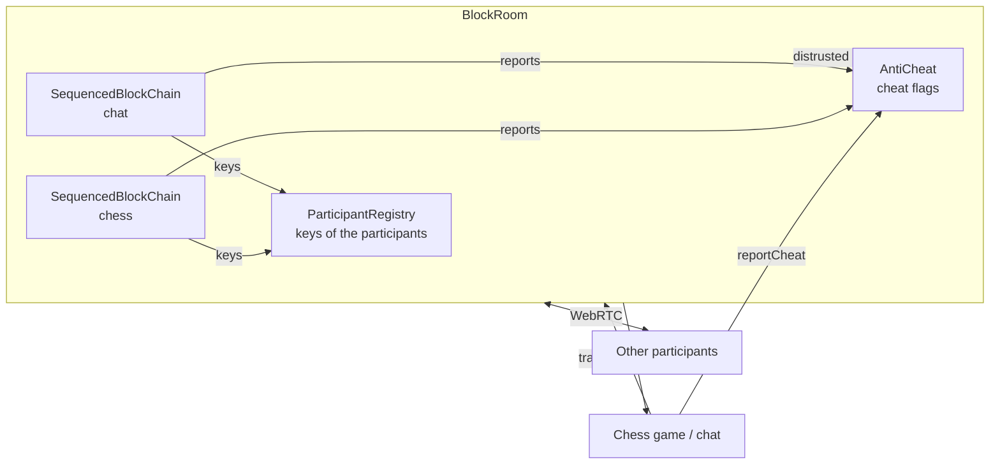
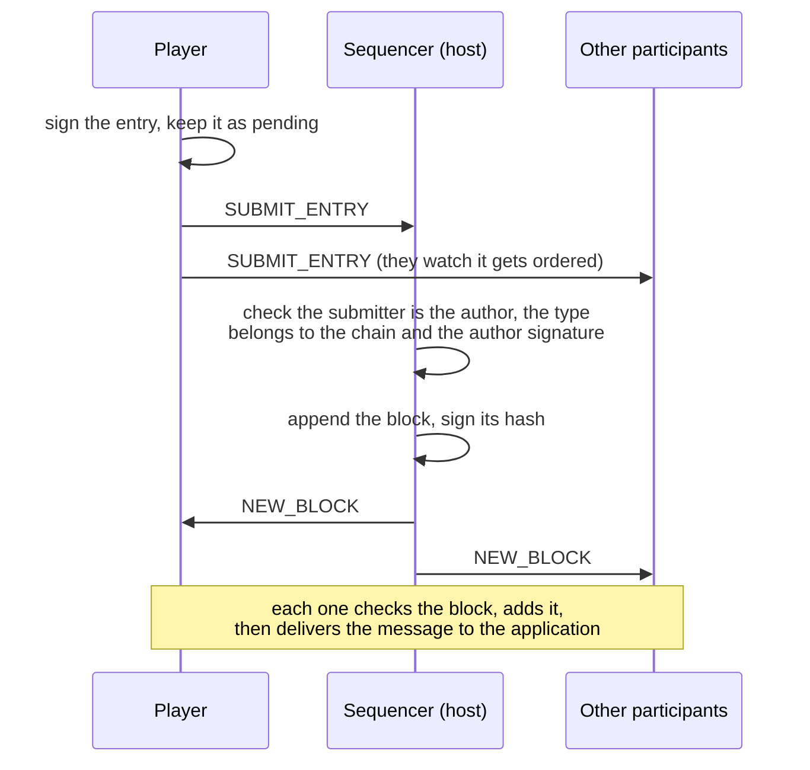
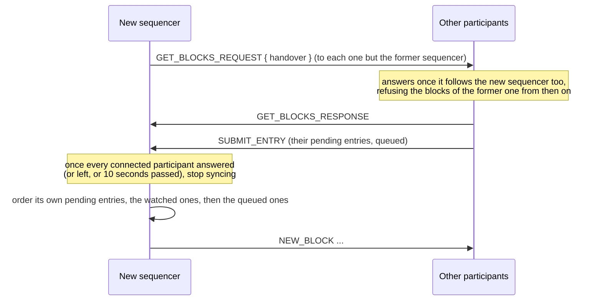

# Block chains and anti-cheat

The players of a room talk directly to each other over WebRTC, without a game server. Every chess move
and chat message goes through a **block chain**, so that all the participants receive the same
messages in the same order and can check who wrote them. An **anti-cheat** system runs beside the
chains: the participants watch the one ordering the blocks, check what they receive, and report the
cheats to each other.

The code lives in `application/frontend/game-app/src/app/services/room-manager/classes/room/block-room`.

- [Overview](#overview)
- [Identity of the participants](#identity-of-the-participants)
- [Blocks and signatures](#blocks-and-signatures)
- [Ordering the blocks](#ordering-the-blocks)
- [Delivering the blocks](#delivering-the-blocks)
- [Catching up](#catching-up)
- [Watching the sequencer](#watching-the-sequencer)
- [Changing the sequencer](#changing-the-sequencer)
- [Hidden moves: commit then reveal](#hidden-moves-commit-then-reveal)
- [Anti-cheat](#anti-cheat)
- [Messages](#messages)
- [Trust model and limits](#trust-model-and-limits)
- [Adding a message type or a chain](#adding-a-message-type-or-a-chain)

## Overview

A room (`BlockRoom`) runs **one block chain per feature**: `chat` and `chess`. Each chain orders its
blocks on its own, so a busy chat never delays the moves of the game. The chains share the WebRTC
connections and the identity of the participants.

Each chain is ordered by a single participant, the **sequencer**: the host of the room, then the
participant taking over when it leaves or when most of the others report it as cheating. The
participants sign their messages and submit them to the sequencer, which appends them to the chain
and broadcasts the blocks. A single participant orders the chain, so it can not fork; the others
watch it.



| Class | File | Role |
|---|---|---|
| `BlockRoom` | `block-room.ts` | Routes each message type to its chain, dispatches the received messages, names the sequencer, ticks the chains every 2 seconds |
| `SequencedBlockChain` | `block-chain/sequenced-block-chain.ts` | Submits, orders, receives, checks and delivers the blocks of one chain, watches the sequencer |
| `Chain` | `block-chain/chain.ts` | The list of blocks, hashing and signing |
| `ParticipantRegistry` | `block-chain/participant-registry.ts` | Exchanges the public keys, shared by all the chains |
| `ParticipantKeyStore` | `block-chain/participant-key-store.ts` | Keeps the key pair of the player in the browser |
| `AntiCheat` | `anti-cheat/anti-cheat.ts` | Collects the cheat reports into flags, names the accusers of a sequencer |
| `SynchronousChessOnlineGameSession` | `modules/chess/classes/game-sessions` | Seats the players, commits then reveals the moves, reports the cheated ones (see [Chess game session](chess-game-session.md)) |
| `SealedTurnStore` | `modules/chess/classes/game-sessions` | Keeps the hidden moves across the reloads of the page |

The application only sees `Room.transmitMessage()`, `Room.messenger()` and `Room.reportCheat()`: a
message is delivered to every participant, its sender included, once its block is added to the chain
and checked.

## Identity of the participants

Each player has an **ECDSA P-384 key pair**, which signs its messages.

- **Kept across reloads.** `ParticipantKeyStore` stores the key pair of each player name in IndexedDB
  (database `synchronous-chess`, store `participant-keys`). A player reloading the page keeps its
  identity, so the blocks it signed before stay verifiable. The private key is not extractable: it
  can only sign. Without storage (private browsing, blocked site data), the page uses a key pair of
  its own, which a reload replaces.
- **Exchanged once per room.** `ParticipantRegistry` sends the public key to each new player, for all
  the chains at once. The request carries the key of the requester too, so if a request is lost (sent
  before the other side knew the player), the request of the other side still exchanges both keys.
  The key of a connection is registered once, from its request or its response.
- **Keyring.** A participant keeps the keys of the previous connections of its player: a player who
  lost its stored key signs with a new one, and its older blocks stay verifiable.
- **Departed participants** are kept 60 seconds, the time for the blocks they wrote to reach everyone,
  then forgotten. A participant who leaves before any of its keys is known is forgotten at once.

## Blocks and signatures

```ts
interface ChainEntry {      // a message of a participant
    id: string;            // random UUID, to detect a replayed entry
    data: AppMessage;      // { from, type, payload }
    signature: string;     // by the author
}

class Block {
    index: number;
    previousHash: string;
    entry: ChainEntry;
    sequencer: string;          // the participant who ordered the block
    hash: string;
    sequencerSignature: string; // by the sequencer, over the hash
}
```

| What | Signed or hashed content | By |
|---|---|---|
| Entry signature | `chain id JSON(data)` | the author (`data.from`) |
| Block hash (SHA-256) | `chain index previousHash sequencer entry.id entry.signature JSON(entry.data)` | |
| Sequencer signature | the block hash | the sequencer |

The **chain name** is part of both the entry signature and the block hash: an entry or a block of one
chain is not valid on another chain of the room.

The genesis block (index 0) is the same for every chain, with a fixed hash.

## Ordering the blocks



- An entry is submitted to **every participant**: the sequencer orders it, the others watch it.
- A participant accepts an entry only from its own author: the WebRTC connection proves who sent it.
  It checks the author signature: the sequencer before ordering, so it can not be blamed for a forged
  entry, the others before watching, so they do not report an honest sequencer for refusing it. The
  entries of an author whose key is still being exchanged wait for it (at most 32 per author). An entry
  already in the chain (submitted again) is not ordered twice.
- When the sequencer transmits a message, it orders the entry directly.
- A participant adds a `NEW_BLOCK` only from its current sequencer. Each chain handles its messages one
  at a time, so the blocks are added strictly in order.
- The entries of the local participant stay **pending** until their block is added: they are submitted
  again when the sequencer becomes ready (its key is received) or when it changes.

## Delivering the blocks

Every block the sequencer sends is added to the chain, so that the chains of all the participants stay
the same. The application receives the blocks **in their order, once checked**, and every participant
leaves the same cheated blocks out of it, so that the game and the chat stay the same everywhere:

- a block not signed by its sequencer, a replayed entry, or an entry of another chain is left out;
- an entry not signed by its author is left out;
- the entry of an author whose key is still being exchanged waits for the key, and the next blocks
  with it;
- the entry of an author who left before the participant joined (unknown) is delivered: its key can
  not be known.

## Catching up

A participant missing blocks asks for them with `GET_BLOCKS_REQUEST { from }`, the index of its next
block. The response carries at most **50 blocks**, to fit in a data channel message; a full page is
followed by a request for the next one.

A participant catches up:

- with the sequencer, once the key of the sequencer is received (joining the room);
- with the sequencer, when a `NEW_BLOCK` leaves a gap after its latest block;
- with another participant, whose chain head goes further than its own;
- with the new sequencer, when it changes.

A participant only processes the responses it asked for. A block received from a participant other
than the sequencer must be signed by its sequencer. A refused block stops the catch up with that
participant, since asking again would bring the same block.

## Watching the sequencer

Every 2 seconds, the room ticks its chains:

- **Withheld entries.** Each participant watches the entries submitted to the sequencer, once their
  author signature is checked. An entry the sequencer does not order within **10 seconds**, while it
  orders other entries of the chain, is reported as censored. A new sequencer gets the same delay
  again.
- **Different chains.** Each participant shows the head of its chain (index, hash, sequencer and its
  signature) to the others, and to each new participant once its key is received. A head:
  - further than the local chain makes the participant catch up with the one showing it, so a block the
    sequencer withheld from it still arrives;
  - differing from the local block at the same index, both signed by the same sequencer, proves the
    sequencer sent different chains to the participants: it is reported as a conflicting block. A
    difference without such a proof is only logged.

## Changing the sequencer

The sequencer changes when it leaves, or when **more than half of the other participants** reported
it for a cheat only a sequencer can commit (see the table below). The next sequencer is the first
participant by name among the connected ones, a distrusted sequencer never coming back: every
participant knows the same participants and reports, so they all name the same one. When no
participant can take over, the sequencer stays.



The former sequencer may have sent its last blocks to some participants only. The new sequencer first
collects the blocks of all the participants, so these blocks are kept and **no block is rolled back**:

- The participants notice the change at different times. A participant answers the collection only
  once it follows the new sequencer itself: the blocks the former sequencer sends it until then are
  in its answer, and it refuses the next ones.
- The former sequencer is not asked: it is distrusted, and the blocks it sent are collected from the
  participants who received them.
- A participant not following the new sequencer within **10 seconds** is not waited for anymore, so a
  participant who never answers can not block the chain.

The entries the former sequencer did not order are submitted again by their authors, and the new
sequencer orders the entries it watched before taking over; an entry already in the chain is not
ordered twice.

**Joining after a change.** A player joining the room, or reloading the page, starts with the host as
sequencer: it missed the changes. Once the key of a participant is received, each side tells the other
which sequencer it follows, the number of changes it made and the distrusted sequencers
(`sequencerState`). A participant follows the sequencer that more than half of the other participants
follow, if they made more changes than itself; a single participant can not make it follow another
sequencer.

New players can not join once the host has left: joining goes through the host.

## Hidden moves: commit then reveal

In synchronous chess both players play at the same time. Without care, the first move ordered would
reach the other player before it plays, and the sequencer would see it even before ordering it. The
online game session hides the moves:

1. A player plays its move (or promotion) locally, and sends only a **commitment**: the SHA-256 of
   the turn number, its color, the action and a random salt (`SC_GS_commit`).
2. Once the commitments of every player of the turn are in the chain, each player **reveals** its
   action and salt (`SC_GS_reveal`). A turn played by a single player is revealed at once.
3. The participants check each reveal against the commitment of its player for the current turn, then
   run it. The first commitment of a player for a turn is final.

A reveal not matching its commitment (`invalidReveal`) or a move against the rules (`illegalMove`) is
ignored by every participant alike, and reported against its player with `Room.reportCheat()`.

The turn number is counted by each participant, the same for all of them since they run the same
actions.

A player plays its action at once, and a turn played alone ends at once, so it may play the next turn
before the commitments of the previous one are in the chain: it keeps each action it played until it
is revealed. A player runs its own actions when playing them; after a reload of the page, the chain
replays its reveals, which it runs like the ones of the other players.

**Reloading the page.** `SealedTurnStore` keeps the actions the player committed to and whose reveal
is not in the chain yet, with their salt, in the session storage of the tab (key
`synchronous-chess:sealed-turns:<room>:<player>`). When the chain replays a commitment of the player
that its new page did not play, the stored action of that turn is used if it matches the commitment:
the action of a previous game in a room of the same name never does. It is played once the game
reaches its turn, then revealed as usual. The page does not know whether its reveal is in the chain
already, so it may reveal it twice: the other participants ignore a reveal matching the commitment of
a turn its player already played. Without session storage (blocked site data), the action is lost.

## Anti-cheat

The participants report the cheats they detect with an `anti_cheat` message to all the others, outside
the chains: a report does not need to be ordered, and the sequencer can not hide it.

### Checks

| Reason | Detected when | Against | Left out of the application |
|---|---|---|---|
| `forgedAuthor` | The entry is not signed by any known key of its author | the sequencer, which checks it (counted against it when reported by the author only) | yes |
| `replayedEntry` | The entry id is already in the chain | the sequencer | yes |
| `wrongChain` | The message type belongs to another chain | the sequencer | yes |
| `forgedSequencing` | The block is not signed by its sequencer | the sequencer | yes |
| `invalidBlock` | The hash of a block of the sequencer does not match its content | the sequencer | not added |
| `conflictingBlock` | The sequencer sent another block for an index already in the chain, a block not following the latest one, or a head proves it signed two blocks for the same index | the sequencer | not added |
| `censoredEntry` | The sequencer orders other entries, not this one, for 10 seconds | the sequencer | |
| `illegalMove` | A revealed move is against the rules | the player | yes |
| `invalidReveal` | A revealed move does not match its commitment, or its turn | the player | yes |

The reasons **against the sequencer** count to take the ordering away from it: only reports from
connected participants other than the sequencer count, and more than half of them must have reported
it. A `forgedAuthor` report counts only when the author of the entry makes it: an author giving
different keys to the participants makes some of them find its entries forged, while the sequencer
checked them, so only the author knows for sure its entry was forged.

### Reports and flags

A participant reports a cheat once per subject and reason. `AntiCheat` gathers its own reports and the
reports of the others into **flags**, one per block or withheld entry:

```ts
interface CheatFlag {
    chain: BlockChainName;
    subject: string;    // the hash of the block, or the id of the withheld entry
    index?: number;     // the index of the block, none for a withheld entry
    author: string;     // the author the entry claims
    sequencer: string;
    reports: ReadonlyArray<{ reporter: string; reason: CheatReason }>;
}
```

The room exposes them as the `BlockRoom.cheatFlags` signal. The chess and chat pages notify each new
report (`modules/room-layout/cheat-notifications.ts`).

## Messages

| Origin | Type | Payload | Sent by → to |
|---|---|---|---|
| `block_room_participant` | `getPublicKeyRequest` | `{ publicKey }` | a participant → a new player |
| `block_room_participant` | `getPublicKeyResponse` | `{ publicKey }` | → the requester |
| `block_room_service` | `submitEntry` | `ChainEntry` | a participant → everyone |
| `block_room_service` | `newBlock` | `Block` | the sequencer → everyone |
| `block_room_service` | `getBlocksRequest` | `{ from, handover? }` | a participant → the one it catches up with, a new sequencer → each participant |
| `block_room_service` | `getBlocksResponse` | `Block[]` (at most 50) | → the requester |
| `block_room_service` | `chainHead` | `{ index, hash, sequencer, sequencerSignature }` | a participant → everyone, every 2 seconds |
| `anti_cheat` | `cheatReport` | `CheatReport` | a participant → everyone |
| `anti_cheat` | `sequencerState` | `{ sequencer, handovers, distrusted }` | a participant → each participant whose key it receives |

The `block_room_service` messages carry the name of their chain in a `chain` field.
`isNetworkMessage` validates the envelope of the received messages (origin, type, known chain name);
their payload is trusted, and a payload making a handler throw is logged.

The chess game sends `SC_GS_seat`, `SC_GS_commit` and `SC_GS_reveal` through the
`chess` chain, the chat `chatMessage` through the `chat` chain.

## Trust model and limits

- **The sequencer decides the order**, and can not change the entries, which are signed by their
  authors. Forged, replayed, misrouted, withheld or conflicting blocks are reported, left out of the
  application, and take the ordering away from it once most of the others report it.
- **The moves are hidden** until every player of the turn is committed: neither the sequencer nor the
  opponent can adapt its move.
- **The connection authenticates the sender** of a message (`from` is stamped by the receiving side), so
  submissions and reports need no signature.
- **A majority can take the ordering away.** With two participants, a single report of the other one is
  enough. A group of participants reporting falsely together can name another sequencer, not change
  the blocks.
- **Keys of a player.** Each participant checks the entries against the keys the author gave it, so
  the sequencer can not forge them. A player giving different keys to the participants makes them
  leave its own entries out differently: their games then differ. It can not make them report the
  sequencer.
- **History of departed players.** A participant who joins after a player left for good can not check
  the signatures of its blocks: they are trusted on the hash chain of the sequencer.
- **Reloading during a game** replays the moves from the chain, and the hidden move committed and not
  revealed yet from the session storage. A move played in the new page before the chain replays its
  commitment replaces the stored one, and can not be revealed: the first commitment is final.
- The app is in development: the message format changes freely, all the participants run the same
  build.

## Adding a message type or a chain

The chain of each message type is declared next to the payloads of its feature, with a
`BlockChainRouting`:

```ts
// modules/chat-page/components/chat/chat.component.ts
export const chatBlockChains: BlockChainRouting<ChatPayloads> = {
    [ChatMessengerType.CHAT_MESSAGE]: BlockChainName.CHAT,
};
```

- **New message type**: add it to the payloads of the feature and to its routing; the compiler requires
  every type to be routed.
- **New chain**: add its name to `BlockChainName` (`block-chain-name.enum.ts`) and route the types to it.
- **Page using several features**: merge their routings with `mergeBlockChainRoutings`, which refuses a
  type routed twice, and pass the result to `RoomManagerService.buildBlockRoom`:

```ts
// modules/chess/pages/synchronous-chess/synchronous-chess.ts
this.roomManagerService.buildBlockRoom<ChatPayloads & ChessPayloads>(
    setup, this.maxPlayer, mergeBlockChainRoutings(chatBlockChains, chessBlockChains),
);
```

- **Cheats of the application**: report a delivered message the application finds cheated with
  `room.reportCheat(message, reason)`, as the chess session does for the illegal moves.

To simulate a slow network while debugging, add `?latency=<ms>` to the URL: the sequencer delays the
broadcast of its blocks.
