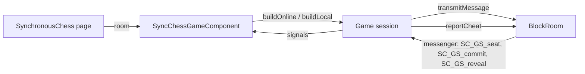
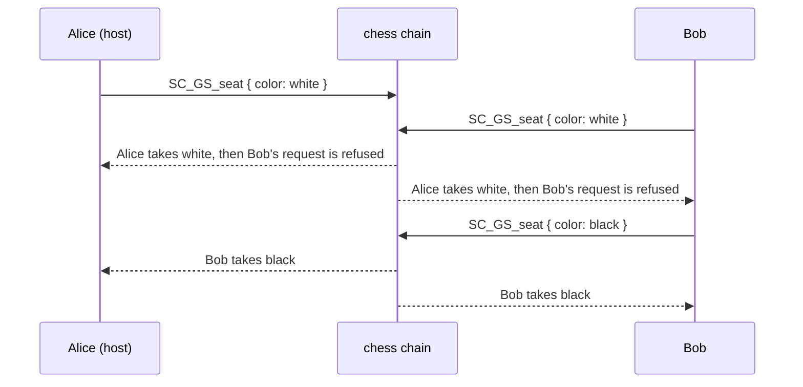
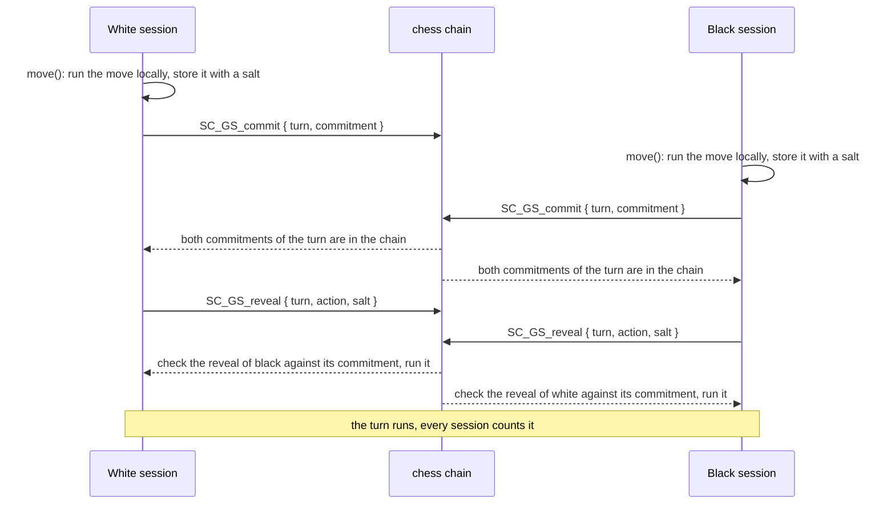

# Chess game session

A **game session** is the state of a synchronous chess game for one participant of a room: the board,
the players seated at it, the turn being played, and the actions the local player sent. Every
participant runs its own session, and the sessions stay the same because they apply the same messages,
in the same order, delivered by the `chess` block chain of the room.

The code lives in `application/frontend/game-app/src/app/modules/chess/classes/game-sessions`. The
ordering and checking of the messages is described in
[Block chains and anti-cheat](blockchain-and-anti-cheat.md).

- [Classes](#classes)
- [Life cycle](#life-cycle)
- [Seats](#seats)
- [Playing a turn](#playing-a-turn)
- [Reloading the page](#reloading-the-page)
- [Messages](#messages)
- [Interface](#interface)
- [Limits](#limits)
- [Testing](#testing)

## Classes

| Class | File | Role |
|---|---|---|
| `SynchronousChessGameSession` | `synchronous-chess-game-session.ts` | Abstract base: the game (`SynchronousChessGame`), the seats (`configuration`), the move preview, the count of the turns run, `runMove` and `runPromotion` |
| `SynchronousChessOnlineGameSession` | `synchronous-chess-online-game-session.ts` | The session of a room: seats, spectators, hidden moves (commit then reveal), cheat reports |
| `SynchronousChessLocalGameSession` | `synchronous-chess-local-game-session.ts` | Without a room: shows the starting board, ignores every action |
| `SynchronousChessGameSessionBuilder` | `synchronous-chess-game-session-builder.ts` | Builds the online session of a room, or the local one |
| `SealedTurnStore` | `sealed-turn-store.ts` | Keeps the hidden action of the local player across the reloads of the page |
| `SyncChessGameComponent` | `components/sync-chess-game` | Shows the session, and turns the clicks and drops into seat requests and actions |

The rules of the game (moves, turns, check) belong to `SynchronousChessGame` and its turns
(`classes/games`, `classes/turns`); the session only decides **who** plays and **when** an action is
applied.

Every participant runs the same online session: the host has no role in the game. It only creates the
room, and orders the block chains until it leaves (see
[Changing the sequencer](blockchain-and-anti-cheat.md#changing-the-sequencer)).

## Life cycle

- The page builds the `BlockRoom` once the room is set up, and gives it to the component.
- The component builds a session from its `room` input: an online session for a room, a local one
  before. Only a new room builds a new session.
- The session subscribes to its message types, and unsubscribes when the component is destroyed
  (`destroy()`).
- The state is made of signals (the board, the seats, the move preview...), read by the template.

## Seats

A session has two seats, white and black. Each participant, the host included, takes a free seat
itself. The others are spectators.

A request is an `SC_GS_seat` message: a color to take the seat of that color, `none` to leave its
seat. Every participant applies the requests **in the order of the chain**, so they all seat the same
players, without anyone deciding for the others:

| Request | Applied when | Effect |
|---|---|---|
| Take a seat | The seat is free | The participant is seated; if it was seated at the other color, that seat is freed |
| Take a seat | The seat is taken by another participant | Refused: the first request in the chain kept the seat, and the participant keeps its own seat |
| Leave its seat | Always, before the game starts | The seat is freed |
| Any | The game has started | Refused: the seats are final |
| Malformed color | | Refused |

A refused request is not a cheat: two participants requesting the same seat at the same time is
expected.

**The game starts** with the first commitment of a player in the chain. From then on, the seats are
final (`seatsOpen()` is false): a player who leaves the room keeps its seat, and can come back to it by
reloading the page.

**Spectators.** `spectatorNumber()` counts the connected participants of the room without a seat. Each
participant counts them from its own list of players.

**Playing.** `playingColor` is the color the local player can play now: its color while both seats
are taken and it has not played the current turn, `none` otherwise. A spectator never plays.

## Playing a turn

The moves are hidden until both players are committed: the session commits to an action first, and
reveals it later (details in
[Hidden moves](blockchain-and-anti-cheat.md#hidden-moves-commit-then-reveal)).

1. **Play.** `move(move)`, `move(null)` (skip an intermediate turn) or `promote(pieceType)` runs the
   action on the local game at once, if the local player is seated and the game accepts it. A move
   shows its preview on the board until the turn runs.
2. **Commit.** The session sends `SC_GS_commit`: the SHA-256 of the turn number, the color, the action
   and a random salt. The action and the salt are kept in memory and in `SealedTurnStore`.
3. **Collect the commitments.** Each session records the first commitment of each seated player for
   each turn; the commitments of a spectator are ignored.
4. **Reveal.** Once the commitments of every color playing the turn are in the chain, the session sends
   `SC_GS_reveal` with its action and salt. A turn played by a single color (an intermediate or a
   promotion turn of one player) is revealed at once.
5. **Apply.** Each session checks a reveal against the commitment of its player for the current turn,
   then runs the action. A reveal not matching its commitment is reported as `invalidReveal`, an
   action the game refuses as `illegalMove`; both are ignored by every session alike.
6. **Next turn.** The game runs the turn once every color playing it has played. The session counts
   the turns run (`turnCount`), the same for every participant.

**The turns.** The game decides which colors play a turn:

| Turn | Played by | Skip |
|---|---|---|
| Synchronous | Both colors | No |
| Intermediate | The colors allowed to capture a piece that moved to an attacked or protected cell | Yes |
| Promotion | The colors with a pawn to promote | No |

A player runs its own action when playing it, and a turn played alone ends at once: it may play the
next turn before the commitments of the previous one are in the chain. The session keeps every action
it played until it is revealed.

## Reloading the page

The player joins the room again under its name. The host notices at once that its former page left,
since the data channels close with it, but the websocket API refuses the name (`Already in game`) until
the host removed the former connection: the page asks to join again every 2 seconds, for 20 seconds
at most (`RoomManagerService`), then tells the name is taken.

A reloaded page builds a new session, and the chain delivers again all its messages:

- the `SC_GS_seat` requests seat the same players again;
- the reveals replay the turns already played, the actions of the local player included;
- the commitment of the local player whose reveal is not in the chain yet is matched with the action
  kept in `SealedTurnStore` (session storage of the tab), played once the game reaches its turn, then
  revealed. A reveal sent twice is ignored by the others.

## Messages

All the messages go through the `chess` chain (`chessBlockChains`), and are delivered to every
participant, the sender included.

| Type | Payload | Sent by | When |
|---|---|---|---|
| `SC_GS_seat` | `{ color: 'w' \| 'b' \| 'none' }` | Any participant | Taking or leaving a seat, before the game starts |
| `SC_GS_commit` | `{ turn, commitment }` | A seated player | Playing an action |
| `SC_GS_reveal` | `{ turn, action, salt }` | A seated player | Once every player of the turn is committed |

`action` is `{ kind: 'move', move }` (`move` is `null` for a skipped turn) or
`{ kind: 'promotion', pieceType }`.

## Interface

`SyncChessGameComponent` shows the session:

- **Seats.** Above and below the board, the name of the player of each color, or `En attente`. Before
  the game starts, a free seat shows `Jouer les blancs` / `Jouer les noirs`, and the seat of the local
  player shows `Quitter la place`. The local player can take the free seat of the other color, which
  moves it.
- **Turn.** The type of the turn, whether each color has played, the last move of each color, the check
  and checkmate states.
- **Actions.** The local player drags the pieces of `playingColor` only; `Passer` skips an intermediate
  turn; a promotion turn shows the pieces to choose from.
- **Spectators.** `Spectateurs : n`.

## Limits

- **A seat taken before the game starts stays taken** when its player leaves the room: the participants
  notice a departure at different times, so it can not free a seat the same way for all of them. The
  player can come back to it by reloading the page.
- **One game per room**: the seats stay final after a checkmate.
- **Draws** by repetition or by the 50 moves rule are not implemented.

## Testing

- `synchronous-chess-online-game-session.spec.ts` plays games between several sessions with a
  `RoomHub`, which delivers the messages to all of them in a single order, as the chain does, and can
  replay them to a session, as after a reload.
- `sync-chess-game.component.spec.ts` drives the component over a `Room` and a `RoomNetworkMock`.
- In the browser, two tabs are enough: the host and a participant, each taking a seat (see
  [CLAUDE.md](../CLAUDE.md#browser-testing)).
